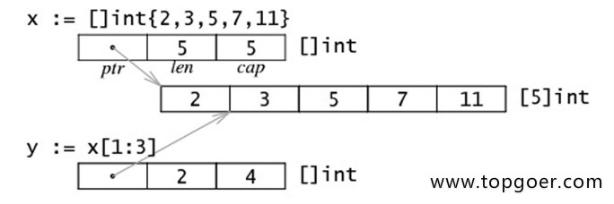

# go slice

## 从数组中得到切片

`c[begin:end:cap]`

如果不指定第三个参数，那么切片的容量是 `cap(c)-begin`，例如 `var c = []int{1,2,3,4,5,6}`那么 `cap(c) = 6`，那么代码 `b := c[1:3]`的长度是2，容量是5

## make得到切片

```go
package main

import "fmt"

func main() {
    s1 := []int{0, 1, 2, 3, 8: 100} // 通过初始化表达式构造，可使用索引号。
    fmt.Println(s1, len(s1), cap(s1))

    s2 := make([]int, 6, 8) // 使用 make 创建，指定 len 和 cap 值。
    fmt.Println(s2, len(s2), cap(s2))

    s3 := make([]int, 6) // 省略 cap，相当于 cap = len。
    fmt.Println(s3, len(s3), cap(s3))
}
```

这是输出的结果：

```txt
    [0 1 2 3 0 0 0 0 100] 9 9
    [0 0 0 0 0 0] 6 8
    [0 0 0 0 0 0] 6 6
```

创建的时候默认最长长度就是cap

slice的底层内存结构：



可以通过&操作符直接获取底层数组

```go
package main

import "fmt"

func main() {
    s := []int{0, 1, 2, 3}
    p := &s[2] // *int, 获取底层数组元素指针。
    *p += 100

    fmt.Println(s)
}
```

使用append在slice后添加内容
`append(a,b...)`在后面追加其他切片
`append(a,1,2,3)`在后面追加内容
特殊场景可以把字符串接到byte切片中
`append([]byte("hello"), "world"...)`
append返回一个新的切片，切片的底层数组是相同的，输出结果不同是因为切片的长度不同导致的。如果append没有超过cap，那么新切片的cap不变，否则重新分配一个底层数组，和原数组无关，并且新切片的cap会适当变大。

## slice的增长规则

在 `runtime\slice.go`中 `growslice`函数

```go
newcap := oldCap
doublecap := newcap + newcap
if newLen > doublecap {
    newcap = newLen
} else {
    const threshold = 256
    if oldCap < threshold {
        newcap = doublecap
    } else {
        // Check 0 < newcap to detect overflow
        // and prevent an infinite loop.
        for 0 < newcap && newcap < newLen {
            // Transition from growing 2x for small slices
            // to growing 1.25x for large slices. This formula
            // gives a smooth-ish transition between the two.
            newcap += (newcap + 3*threshold) / 4
        }
        // Set newcap to the requested cap when
        // the newcap calculation overflowed.
        if newcap <= 0 {
            newcap = newLen
        }
    }
}
```

```txt
oldPtr = pointer to the slice's backing array
newLen = new length (= oldLen + num)
oldCap = original slice's capacity.
num = number of elements being added
```

每个版本的go语言给出的源码是不一样的，根据版本不同有不同的增长方式
