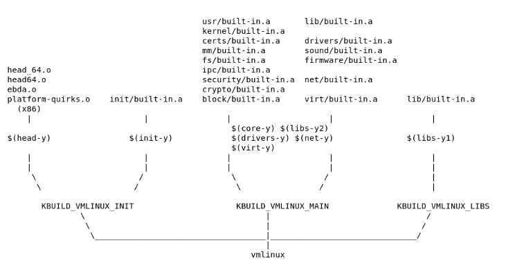
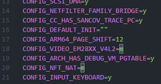
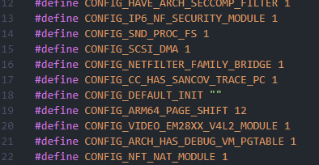
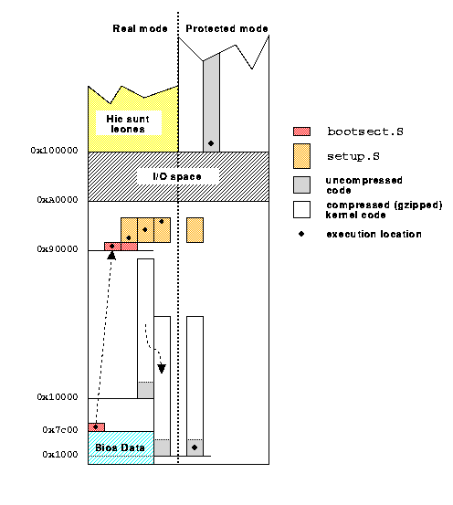

# Kconfig/KBuild in Linux​  

## 问题  

1. Kconfig/KBuild是什么  
2. Kconfig/KBuild在Linux中是怎么使用的  
3. Linux在执行编译涉及到了大致哪些操作  
4. Linux如何做增量编译的？它是如何知道哪些文件需要重新编译  
5. 编译完毕产生的vmlinux和bzImage的区别  

### Kconfig/Kbuild是什么; 在Linux中怎么使用的; Kbuild执行时做了哪些递归编译

Kconfig是用来批量管理config的工具，本质上Kconfig只是一种语言。在Linux中执行 make help 可以查看到有关设置的各种含义，其中config相关的含义在 Configuration targets: 下面。其中用的最多的是menuconfig，以菜单的形式编辑和查看config。  

Kbuild在Linux编译时生成modules.order, modules.builtin, modules.builtin.modinfo这些文件。使用Kbuild构建可以设置很多环境变量[1]。  

Kbuild用来触发递归的make操作，Kbuild用来管理大型的项目很合适。Kbuild可以将构建分到各个组件中。  

Kbuild系统中的Makefile包含下面几个部分：  

1. Makefile： 顶层的Makefile  
2. .config：编译设置  
3. arch/\$(ARCH)/Makefile：不同架构的Makefile，供给顶层使用  
4. scripts/Makefile.\*: 描述了所有Kbuild makefiles的基本的编译规则  
在顶层Makefile里面会定义需要link到vmlinux的一些需要构建的对象  

```Makefile
core-y := init/ usr/  
drivers-y : $=$ drivers/ sound/  
drivers-\$(CONFIG_SAMPLES) $+=$ samples/  
drivers-\$(CONFIG_NET) $+=$ net/  
drivers-y $+=$ virt/  
libs-y : $=$ lib/  
```

#### 然后在编译vmlinux的时候将编译的目标设置传递给Kbuild  

```Makefile
ifeq (\$(KBUILD_EXTMOD),)   
core-y $+=$ kernel/ certs/ mm/ fs/ ipc/ security/ crypto/ block/   
  
ifdef CONFIG_RUST   
core-y $+=$ rust/   
endif   
  
vmlinux-dirs : $=\$5$ (patsubst %/,%,\$(filter %/, \   
\$(core-y) \$(core-m) \$(drivers-y) \$(drivers-m) \   
\$(libs-y) \$(libs-m)))
```  

能看到在某些config开启的情况下之前定义的变量会修改。在Makefile中大概定义了名字类似KBUILD_VMLINUX_\*的一些变量，这些变量在编译Linux的时候会决定Kbuild遍历哪些文件以构建vmlinux。下面附带一张18年博客对vmlinux构建的步骤的大致划分[2]。需要注意的是图中的一些变量在最新的Linux里已经不存在了，例如KBUILD_VMLINUX_INIT。这个图只能作为一个简化助于理解编译的过程  

<div style="text-align: center;">
     
</div> 

.config并不是最终kernel build时采用的设置，syncconfig会对.config做处理生成一系列的.conf文件，生成的文件分成三大类：  

1. include/config/auto.conf & include/config/tristate.conf这两个文件用于make进程处理一些设置  

    <div style="text-align: center;">
         
    </div>

1. include/generated/autoconf.h这个文件用于在C文件中使用设置文件里面全是对设置的#define  

    <div style="text-align: center;">
        
    </div>  

1. include/config/\*.h：这些都是空的头文件，又来给Kbuild对文件进行追踪判断是否需要重新编译注意：这些文件似乎在新版本Linux中并不是以.h结尾  

## Linux是如何做增量编译的  

在编译完成之后总是会生成一些以.cmd作为后缀的文件。这些文件含有两个部分的内容：  

1. 命令行参数  
2. 文件需要的依赖头文件  
cmd文件的内容样式如下：（这里以.vmlinux.cmd为例子）  

```Makefile
cmd_vmlinux := sh scripts/link-vmlinux.sh "ld.lld" "-EL  -maarch64elf -z norelro" "--no-undefined -X -shared -Bsymbolic -z notext  --no-apply-dynamic-relocs --fix-cortex-a53-843419 --build-id=sha1 --pack-dyn-relocs=relr --use-android-relr-tags --orphan-handling=warn";  true

source_vmlinux := scripts/link-vmlinux.sh

deps_vmlinux := \
    $(wildcard include/config/LTO_CLANG) \
    $(wildcard include/config/MODVERSIONS) \
    $(wildcard include/config/STACK_VALIDATION) \
```

文件里面定义的deps_vmlinux变量表示了依赖的头文件，在include/config下有很多这种大写的文件，这些文件都是空文件。wildcard是make中的一个语法[3]，用来对内容做拓展。只要字符串匹配到了pattern就符合wildcard。  

举个例子\$(wildcard \*.c)将会获得当前目录下的所有.c文件。还有一些比较常用的Make里面的Textfunction，比如patsubst，filter等[4]。  

gcc提供了编译参数 -MD 将这些依赖存储到一个文件中。例如下面这个例子在编译C的flag里面加了-MD并且把内容存在\$(depfile)。Linux在编译的时候将这些depfile存储起来（虽然我编译之后似乎看不到很多的.d文件，先暂时这么理解了）  

```Makefile
# In scripts/Makefile.lib
c_flags        = -Wp,-MD,$(depfile) $(NOSTDINC_FLAGS) $(LINUXINCLUDE)     \
                 -include $(srctree)/include/linux/compiler_types.h       \
                 $(__c_flags) $(modkern_cflags)                           \
                 $(basename_flags) $(modname_flags)
```

.d文件的内容就像下面这样：（以编译完成之后生成的.missing-syscalls.d)  

```D
-.o: include/linux/compiler-version.h include/linux/kconfig.h \
  include/generated/autoconf.h include/linux/compiler_types.h \
  include/linux/compiler_attributes.h include/linux/compiler-clang.h \
  arch/arm64/include/asm/compiler.h \
  arch/arm64/include/generated/uapi/asm/types.h \
  include/uapi/asm-generic/types.h include/asm-generic/int-ll64.h \
  include/uapi/asm-generic/int-ll64.h \
  arch/arm64/include/uapi/asm/bitsperlong.h \
  include/asm-generic/bitsperlong.h \
  include/uapi/asm-generic/bitsperlong.h arch/arm64/include/asm/unistd.h \
  arch/arm64/include/uapi/asm/unistd.h include/uapi/asm-generic/unistd.h
```

xdep程序会读取.d文件和.cmd文件去追踪文件是否需要重新编译。具体的操作参考下面[2]：  

> The secret behind this is that fixdep will parse the depfile (.d file), then parse all the dependency files inside, search the text for all the CONFIG_ strings, convert them to the corresponding empty header file, and add them to the target's prerequisites. Every time the configuration changes, the corresponding empty header file will be updated, too, so kbuild can detect that change and rebuild the target that depends on it. Because the command line is also recorded, it is easy to compare the last and current compiling parameters.  

翻译过来的大致意思是fixdep会将.d文件中的依赖头文件提取出来然后搜索以CONFIG_开头的字符串将他们变成空的header file，把他们加进目标的依赖文件中。每次设置改变了，空头文件也会改变，所以Kbuild就会重新编译它们。因为命令行也存储了，所以也能很容易比较命令行是不是相同。  

疑问：文件内容更改时，Linux的Kbuild是怎么察觉并做增量编译的呢？是否只有在config修改的时候才会做增量编译？  

### 编译完毕产生的vmlinux和bzImage的区别  

vmlinux和bzImage的区别一句话来说就是bzImage比vmlinux多链接了一些.o文件[5]  
bzImage 文件采用特定格式。它包含串联`bootsect.o`的 + `setup.o`  + `misc.o` +  
`piggy.o` 。 `piggy.o`  包含 gzip 压缩的 vmlinux 文件的数据部分。  
vmlinux  是一个静态链接的可执行文件，其中包含 Linux 支持的目标文件格式之一的 Linux 内核，其中包括可执行和可链接格式 （ELF） 和通用对象文件格式 （COFF）。  

<div style="text-align: center;">
    
</div>  

附带一张抽象的图： （并不是完全看懂了）  

## 参考文献  

[1] https://docs.kernel.org/kbuild/kbuild.html  

[2] https://opensource.com/article/18/10/kbuild-and-kconfig   
[3] https://www.gnu.org/software/make/manual/html_node/Wildcard-Function.html   
[4] https://www.gnu.org/software/make/manual/html_node/Text-Functions.html   
[5] https://en.wikipedia.org/wiki/Vmlinux  

## 注意  

随着时间的推移一些操作可能并不按照该文描述的那样。Kbuild和Kconfig在Linux中的使用方式可能有所变化。  